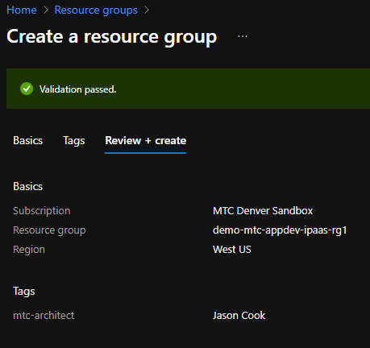
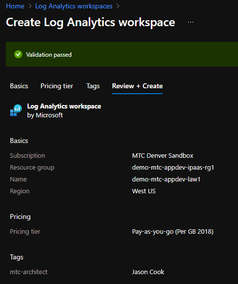
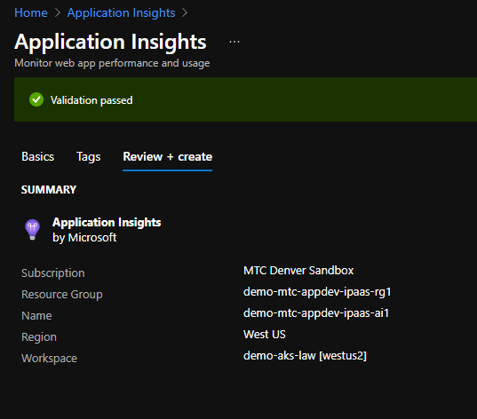
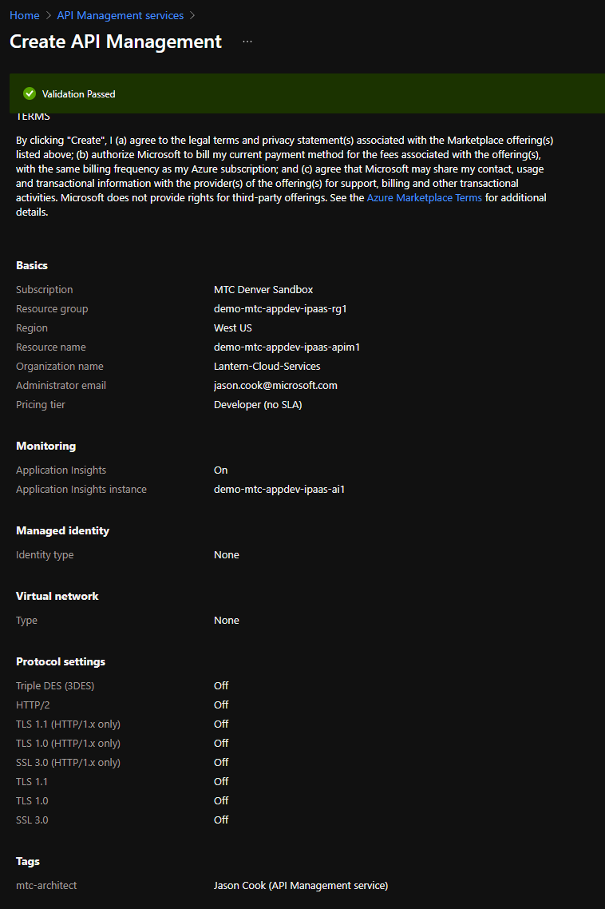
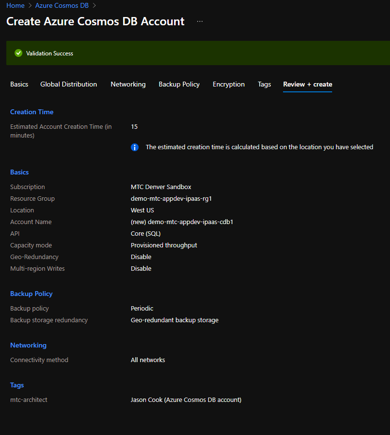
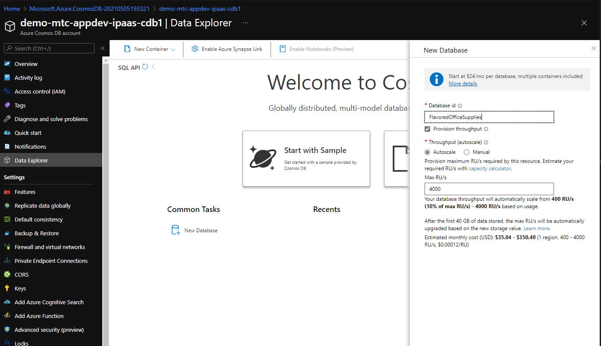
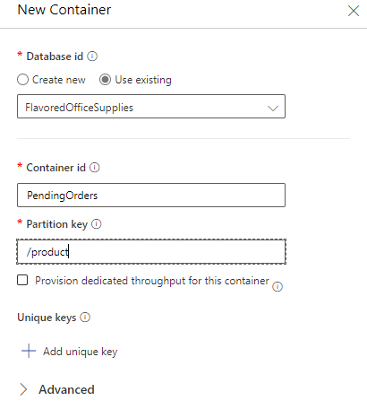
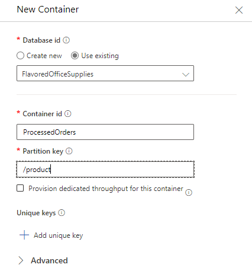

# Exercise 2 - Core Infrastructure

In this exercise you'll create all of the required core infrastructure services that support the workflow of the order processor.  These resources are:

- Resource Group that contains all the resources for the project.
- Log Analytics Workspace for logging related functionality.
- Application Insights for metrics and application performance monitoring.
- API Management to provide gateway and reverse proxy functionality.
- CosmosDB for persistence of order related funcitonality.

Steps:

1) Create the resource group that will contain all of the resources for the project:

    

2) Create the Log Analytics Workspace:

    

3) Create the Application Insights Instance:

    

4) Provision an APIM instance, 

    **NOTE:** when selecting the Pricing Tier for this service, any SKU higher than Developer will need approximately 1 hour to provision:

    

5) Provision the CosmosDB instance:

    

    a) Create the database "FlavoredOfficeSupplies" that will contain the two required collections:

    

    b) Create the Container "PendingOrders" that will hold the pre-processed orders 
    
    **NOTE:** the selection of the partition key being "/product":

    

    C) Create the Container "ProcessedOrders" that will hold the completed orders 
    
    **NOTE:** the selection of the partition key being "/product":

    

All required core infrastructure related services are now provisioned and you can now move to [Exercise 3: Create Order Receiver Logic App](./03-order-reciever-la.md).