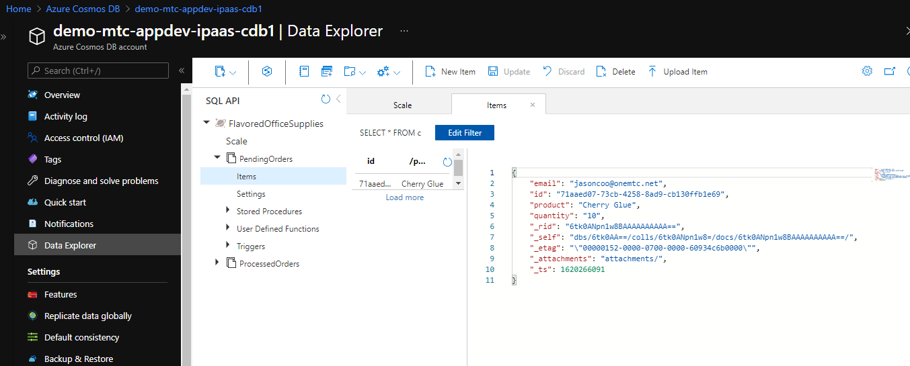
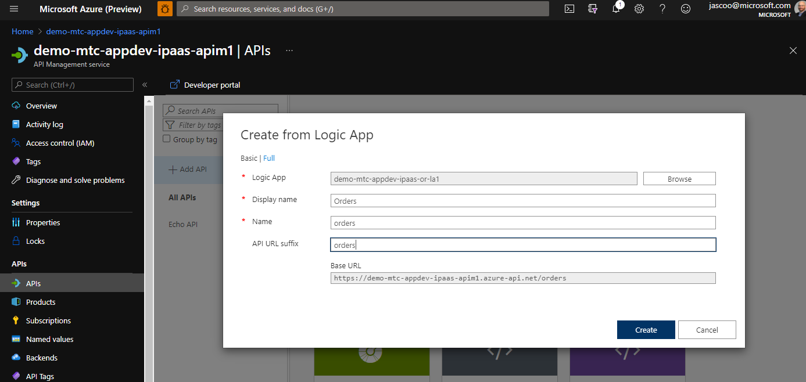
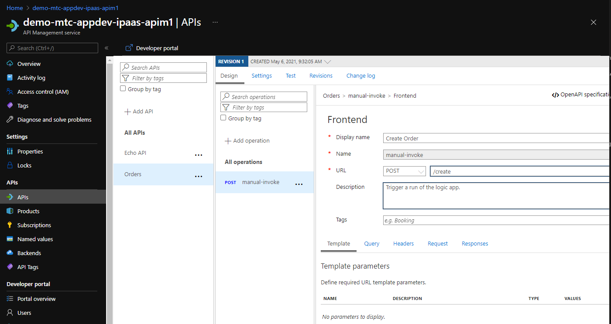
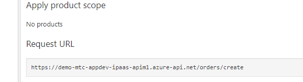
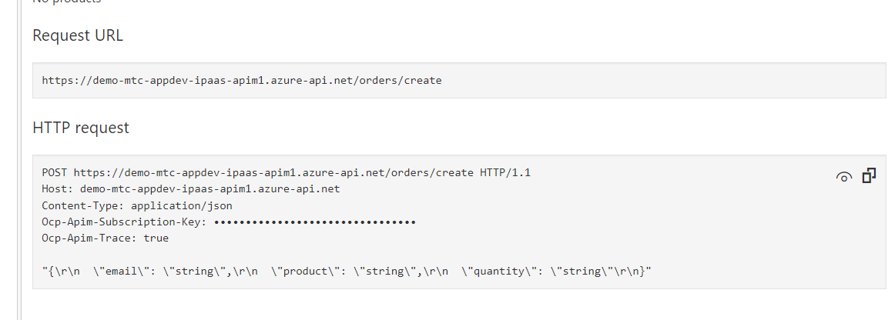
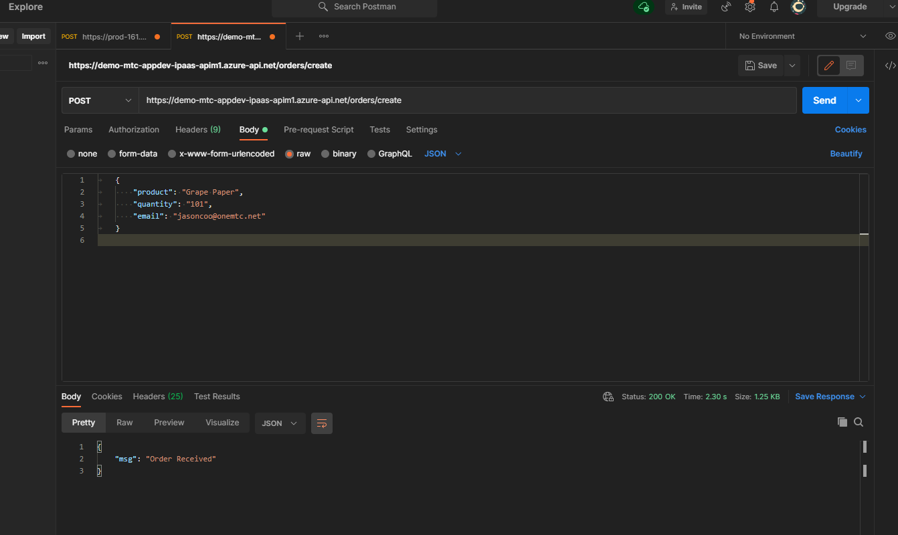
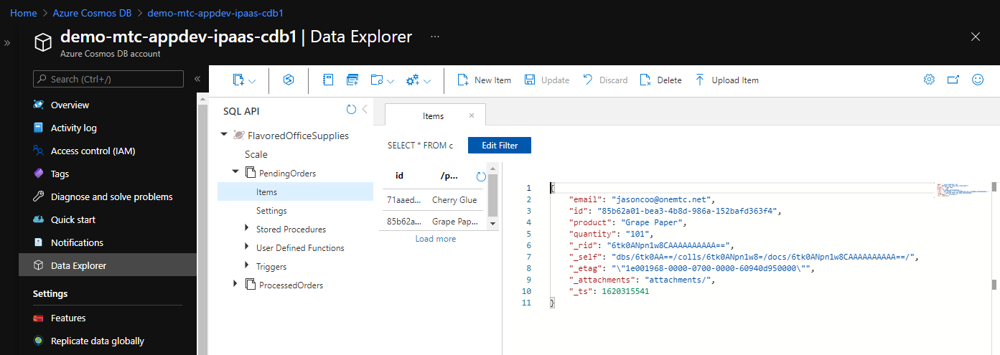

# Exercise 3 - Order Receiver Logic App

In the exercise we'll create the Logic App that is responsible for recieving the pre-processed order document and persisting it to the CosmosDB PreProcessed collection.  We'll also integrate the Logic App with our APIM instance.

1) Begin by provisioning the Logic App:

    

2) Create a workflow starting with an HTTP rest trigger:

    

    - Use the following sample payload to create the JSON schema:

        	{
	            "product": "Cherry Glue",
	            "quantity": "10",
	            "email": "jasoncoo@onemtc.net"
	        }
    
    - The request method is POST

3) Create an action to create or update a document:

    **Note:** when using a prev V3 action the "Partition Key Value" is required.

    Pre V3
    

    V3
    

    - The Database/Collection IDs are FlavoredOfficeSupplies/PendingOrders
    - The document to be persisted should match the structure of the inbound rest JSON document and with values dynamically generated from the HTTP request triggered as pictured.
    - An ID should be programatically created using a dynamic expression for creating a guid().

4) Next, create a response action as follows:

    

5) Save the created workflow and test using the newly generated POST URL:

    a) Using Postman we can confirm that when submitting a JSON order document, we receive a response body and code of 200.

    

    b) Confirmj that the order is persisted in the Cosmos PendingOrders Collection.

    

6) Integrate the Logic App with APIM:

    a) Create the "Orders" API

    

    b) Re-write the front end URL and request display name to a more relevant name and path:

    From:

    

    To:
    
    

    - Display name: "Create Order"
    - URL: /create

    The new path is now:
    
    

7) Test the new APIM fronted endpoint using Postman:

    **Note:** Remember to use the APIM subscription key obtained from the Test tab in the APIs blade:
    
    

    a) Submit the request using Postman:

    

    b) Confirm the new order is persisted in the Cosmos "PendingOrders" collection:

    

The order reciever Logic App is now complete and will process and persist incoming order documents.  Continue to [Exercise 4: Create Order Processor Logic App](./04-order-processor-la.md) to implement the Logic App that will process and persist completed order documents.
