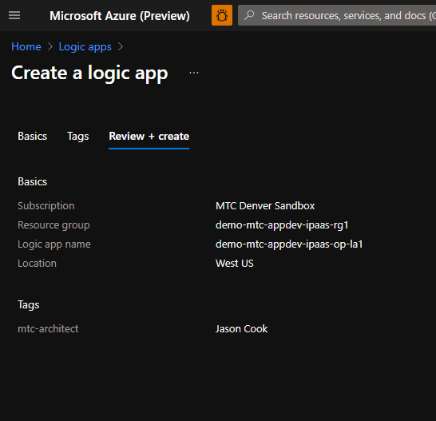
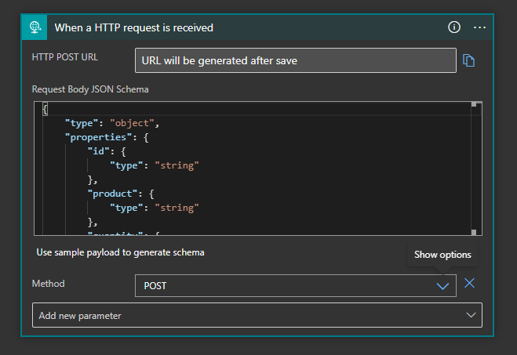
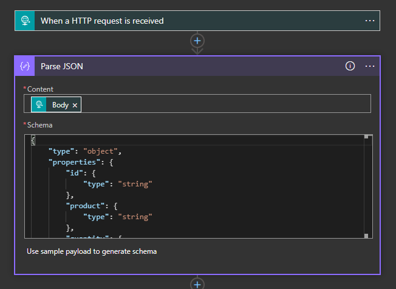
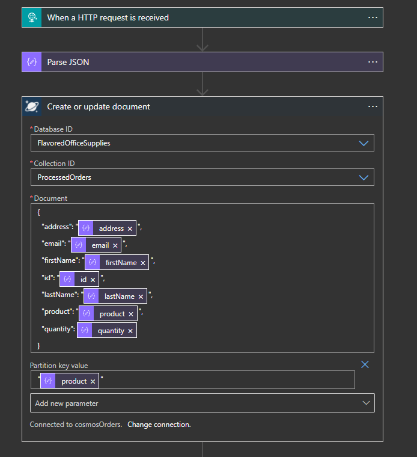
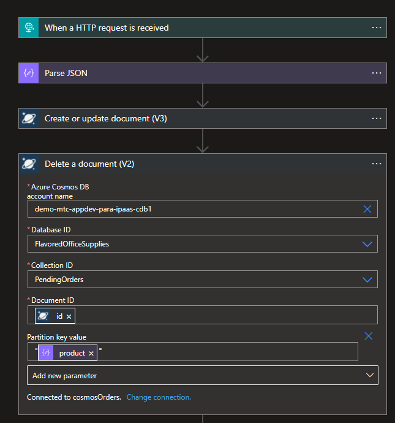
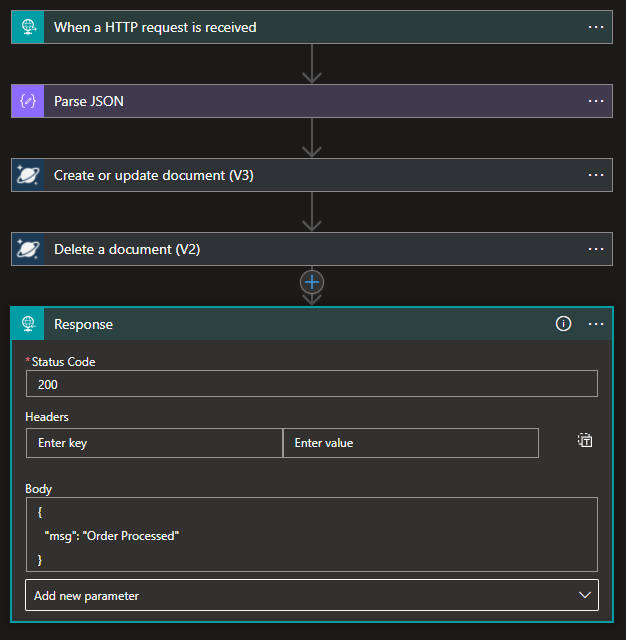
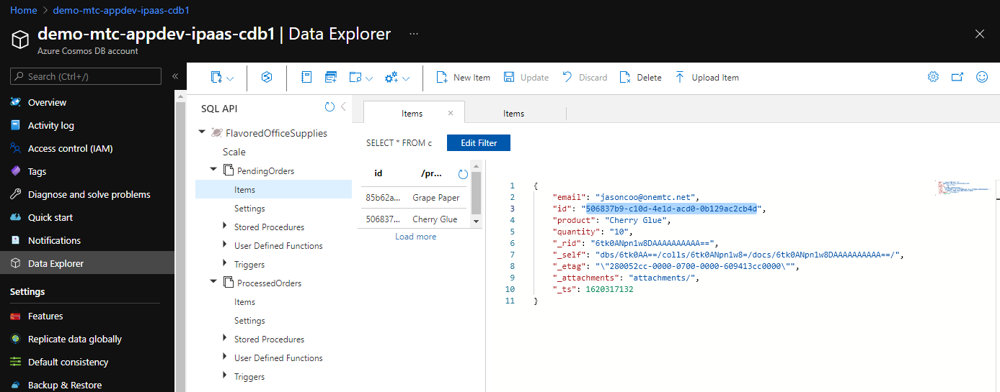
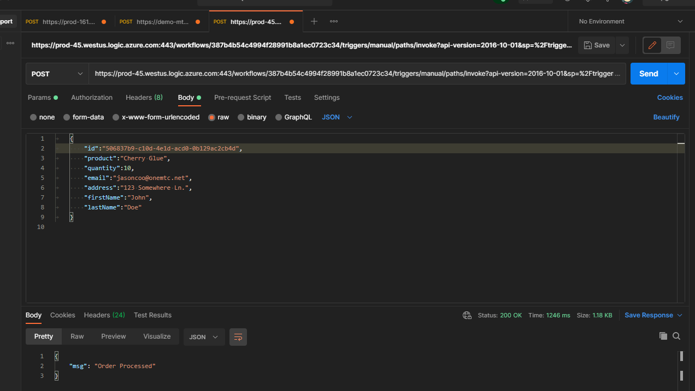
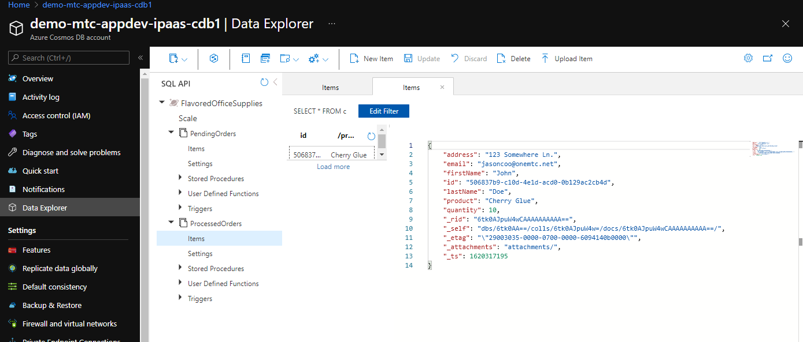

# Exercise 4 - Order PRocessor Logic App

In the exercise we'll create the Logic App that is responsible for processing the recieved order document that has been persisted in the "PendingOrders" collection.  The Logic App is implemented as an HTTP request trigger that will recieve the conceptually completed order document.  It will persist the order to the "ProcessedOrders" collection and delete the preprocessed order document.  We'll again front the API with APIM and test/ Later we'll modify this Logic App to also put the completed order onto a Service Bus queue to continue processing.

1) Create the order processor Logic App:

    

2) Create the HTTP request trigger:

    

    - Use the following sample payload representing a completed order to create the JSON schema:

            {
                "id":"b878b264-0b22-484e-a564-484ad1dc6f91",
                "product":"Grape Paper",
                "quantity":100,
                "email":"jasoncoo@onemtc.net",
                "address":"123 Somewhere Ln.",
                "firstName":"John",
                "lastName":"Doe"
            }

        
    - The request method is POST

3) Parse the JSON of the incoming HTTP request body to paramaterize each element of the JSON document:

    

    - Use the same sample payload from the http request but replace the values in the JSON with dynamic properties from the HTTP request.

4) Create an action to create or update a document, this will persist the newly created completed order document:

    **Note:** when using a prev V3 action the "Partition Key Value" is required.

    Pre V3
    

    V3
    

    - The Database/Collection IDs are FlavoredOfficeSupplies/ProcessedOrders
    - The document to be persisted should match the structure of the inbound rest JSON document and with values dynamically generated from the JSON action as pictured.
    

5) Next delete the pre processed order document from the "PendingOrders" collection, use the Document ID from the previous consmos action:

    

6) Create an HTTP Response action and provide a relevant response message:

    

7) Save and test the Logic App again using Postman:

    a) Take the values from an existing pre processed order document in the "PreProcessed" Cosmos collection:  
    
    

    b) Submit the request to the Logic App endpoint using Postman:

    

    - Confirm that you receive a valid response.

    c) Using the Cosmos Data Explorer, confirm that the pending order with the same ID has been deleted from the "PendingOrders" collection and that the new completed order has been persisted to the "ProcessedOrders" collection:

    

8) Integrate the Logic App with APIM.

    a) Begin by cloning the existing Orders API.  You could also choose to implement the new process order API as a it own first order API.  This highlights a philosophical choice when structuring you APIs, you can either group only REST verbs under the same API.
