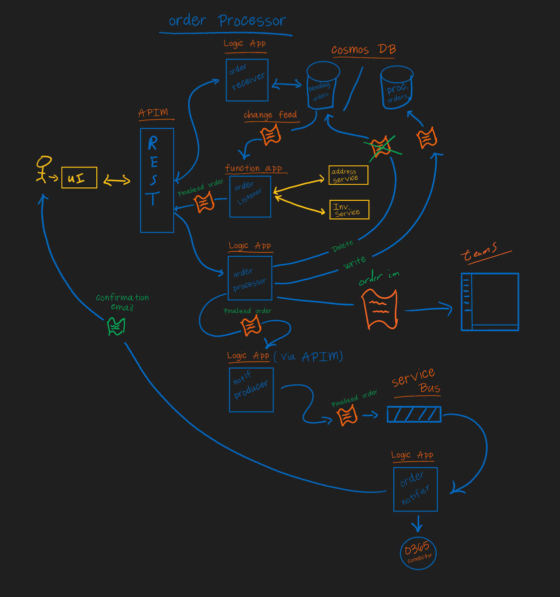

# Azure Integration Platform as a Service Workshop / Demo

## Content Overview
- [Stub] one pager
- The content created in the workshop is designed to be delivered in of the following formats:
  - [MTC Strategy Briefing](./00-mtc-sb.md) - 3-4 hour functionality overview and demo
  - [MTC Hands on Lab](./00-mtc-hol.md) - Full day content created by customer
  - [MTC 1:Many Presentation](./00-mtc-1m.md) - 3 hour functionality overview and demo to a 1:many audience
## Architecture Overview

## Resources Descriptions
- Resources group - Contains all workshop resources.
	
- CosmosDB - Stores Pre/Post processed order documents.
	
- API Management service - Serves as a request proxy and gateway.

- Service Bus - Serves as an integration point between the order processing system and the enterprise email system.  In practice this messaging bus could also serve as abstraction point between any inter process communication or integration.
	
- Function app - Recieves Cosmos change events and acts as an integration point with other external services (address services, inventory service, etc.)
	
- Logic apps - Provides the business workflows
	- Incoming order receiver
	- Complete order processor
	- Service Bus notification queue producer
	- Service Bus notification consumer / email producer

- Office 365 tenant - Email provider / integration user account provider
	Order Notifier - Notifier service integration
	Orders - Email notification account

## Process Flow

The overall process flow for this architectute is:

  1) The theoretical UI submits an order request via REST interface to the Order API.
  2) An HTTP triggered Logic App recieves the order document and persists it to the CosmosDB pending orders container.
  3) CosmosDB generates a change feed event.
  4) The order processing Function App is triggered by the CosmosDB change feed event.
  5) The Function aApp calls a (mocked) customer address service to obtain customer information. The Function App then creates an aggregated document representing the order that contains original order information (product, quantity, email) as well customer information.
  6) The Function App then calls the order processor HTTP Logic App, which receives the aggregated order document, persists a new complete order document to the processed orders CosmosDB container and deletes the original order received document from the pending order container.
  7) The order processor Logic App then calls the notifification producer Logic App with the finalized order document.

      a) (Optionaly) The order processor Logic App may then use the Office 365 Logic App Connector to produce a teams notification, notifying a theoretical distrobution team that an order is ready to be shipped.
      
  8) The Notifier producer Logic App takes the finalized order document and puts it onto a Service Bus.
  9) A notification consumer Logic App retrieves the processed order from the Service Bus, uses the O365 connector to generate an email that is sent to the email address of the customer that created order, notifying them that their order has been processed.

  NOTES: 

- Service Bus is utilized in the demo as a means to demonstrate how to integrate service bus.  Realistically and in practice SB could sit between any of the Fx/LA API calls to make the architecture more event driven.
- It's implied in the reference architecture and implemented such that all calls to HTTP triggers go through APIM.
- The facilitator supplies the credentials to the O365 connector in order to create the email / Instant message.  It's helpful to have a demo tenant set up that can be used to provision a service user on a per demo basis.
- In terms of extensibility, again all HTTP triggers can be converted to SB events making more of event driven architecture.
- All deployment can be automated and full CI/CD with ARM / Bicep and GH actions.

## Build and deploy the reference Order Processor 
### 1. [Prequisite Setup](./01-prequisites.md)

This exercise contains the necessary prequisite setup required for completing the workshop as described.

### 2. [Core Infrastructure Provisioning](./02-core-infra.md)

In this exercise you will set up the related logical infrastructure and supporting PaaS services including:

- Resource Group
- Log Analytics Workspace
- Application Insights
- API Management Service
- CosmosDB and needed containers

### 3. [Create Order Receiver Logic App](./03-order-reciever-la.md)

In this exercise you will create the Logic App responsible for recieving the initial order and persisting it to the pre processed cosmos container.  You will also integrate the Logic App with APIM.

### 4. [Create Order Processor Logic App](./04-order-processor-la.md)

In this exercise you will create the Logic App responsible for proccessing the finalized order, persisting it to the completed orders cosmos container.  You will also integrate the Logic App with APIM.

### 5. [Create Integration Trigger Function App](./05-integration-trigger-function.md)

This exercise will create the CosmosDB trigger functiona app responsible for processing persisted unprocessed orders.

### 6. [Create Integration Service Bus Queue](./06-integration-servicebus.md)

In this exercise you will create the Service Bus instance that will provide the queue for completed order that will be service by a Logic App resulting in customer order complete notifications.

### 7. [Create Service Bus message Producer Logic App](./07-servicebus-producer-la.md)

Here you will create the Logic App responsible for producing the order complete message that will be placed onto the service bus for customer notification.

### 8. [Create Service Bus Consumer Logic App](./08-servicebus-consumer-la.md)

This exercise will create the Logic app responsible for notifiy the customer their order has been processed.

### 9. [(Optional) Integrate Order Notification with Teams](./09-teams-integration.md)

Here you will setup a teams notification process to notify our theoretical warehouse team that an order is ready to ship.

### 10. [End-to-End Functional Test](./10-end-to-end-test.md)

This exercise will tie everything together deomonstrating and executing end to end functionality.

### 11. [End-to-End Monitoring](./11-end-to-end-monitoring.md)

In the final exercise you'll demonstrate end-to-end monitoring by utilizing distributed tracing across all involved services.

## Additional Considerations

stub

## Contributing

This project welcomes contributions and suggestions.  Most contributions require you to agree to a
Contributor License Agreement (CLA) declaring that you have the right to, and actually do, grant us
the rights to use your contribution. For details, visit https://cla.opensource.microsoft.com.

When you submit a pull request, a CLA bot will automatically determine whether you need to provide
a CLA and decorate the PR appropriately (e.g., status check, comment). Simply follow the instructions
provided by the bot. You will only need to do this once across all repos using our CLA.

This project has adopted the [Microsoft Open Source Code of Conduct](https://opensource.microsoft.com/codeofconduct/).
For more information see the [Code of Conduct FAQ](https://opensource.microsoft.com/codeofconduct/faq/) or
contact [opencode@microsoft.com](mailto:opencode@microsoft.com) with any additional questions or comments.

## Trademarks

This project may contain trademarks or logos for projects, products, or services. Authorized use of Microsoft 
trademarks or logos is subject to and must follow 
[Microsoft's Trademark & Brand Guidelines](https://www.microsoft.com/en-us/legal/intellectualproperty/trademarks/usage/general).
Use of Microsoft trademarks or logos in modified versions of this project must not cause confusion or imply Microsoft sponsorship.
Any use of third-party trademarks or logos are subject to those third-party's policies.
